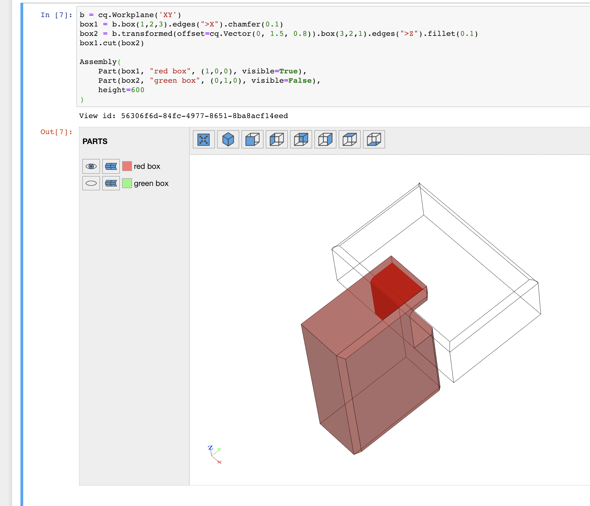

# CadQuery extension for Jupyter

## Overview

An extension to view X3DOM content created by CadQuery 2.x

Two new classes are available:

- Part: A CadQuery shape plus

  - Part name in the view
  - Part color in the view
  - Part visibility in the view

- Assembly: Basically a list of parts and the height attribute of the view

Example:

```python
b = cq.Workplane('XY')
box1 = b.box(1,2,3).edges(">X").chamfer(0.1)
box2 = b.transformed(offset=cq.Vector(0, 1.5, 0.8)).box(3,2,1).edges(">Z").fillet(0.1)
box1.cut(box2)

Assembly(
    Part(box1, "red box", (1,0,0), visible=True), 
    Part(box2, "green box", (0,1,0), visible=False),
    height=600
)
```

- Isometric view:

    

- Side view:

    

## Integration into CadQuery

The extension is self contained, however monkey patches the `_repr_html_` method of the `Shape` class.

## Installation

- Clone the repository and execute from within and execute:

    ```bash
    git clone https://github.com/bernhard-42/cadquery-jupyter-extension.git
    cd cadquery-jupyter-extension
    pip install .
    ```

- Enabling the extension

    ```bash
    jupyter nbextension install cq-jupyter --user
    jupyter nbextension enable cq-jupyter/js/main --user
    ```

## TODOs

- OrthoViewPoint

## Credits

- The viewer
    
    The idea is based on the original implementation in cadquery 2, however leverages a proper Jupyter notebook extension and a Jinja2 template
- x3dom

    The x3dom framework ([https://www.x3dom.org](https://www.x3dom.org)) is available under the MIT license ([https://github.com/x3dom/component-editor/blob/master/LICENSE](https://github.com/x3dom/component-editor/blob/master/LICENSE)) and the files `css/x3dom.css` and `js/x3dom.js` are downloaded from [https://www.x3dom.org/download/1.7.2](https://www.x3dom.org/download/1.7.2) and used unchanged.

- Component Editor for x3dom

    The Component Editor for x3dom ([https://github.com/x3dom/component-editor](https://github.com/x3dom/component-editor)) is available under the MIT license ([https://github.com/x3dom/component-editor/blob/master/LICENSE](https://github.com/x3dom/component-editor/blob/master/LICENSE)): 

    - the file `js/jquery.viewConnector.js` is downloaded from [https://github.com/x3dom/component-editor/blob/master/static/js/jquery.viewConnector.js](https://github.com/x3dom/component-editor/blob/master/static/js/jquery.viewConnector.js) and used unchanged
    - the axis part in the file `x3d_template.j2` is based on [https://github.com/x3dom/component-editor/blob/master/static/x3d/axesSmall.x3d](https://github.com/x3dom/component-editor/blob/master/static/x3d/axesSmall.x3d)

## License

This software is licensed under the MIT license, see [LICENSE](./LICENSE)