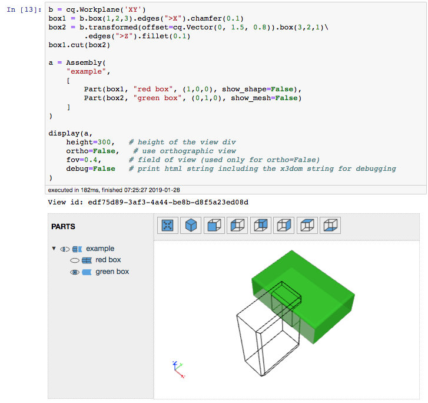
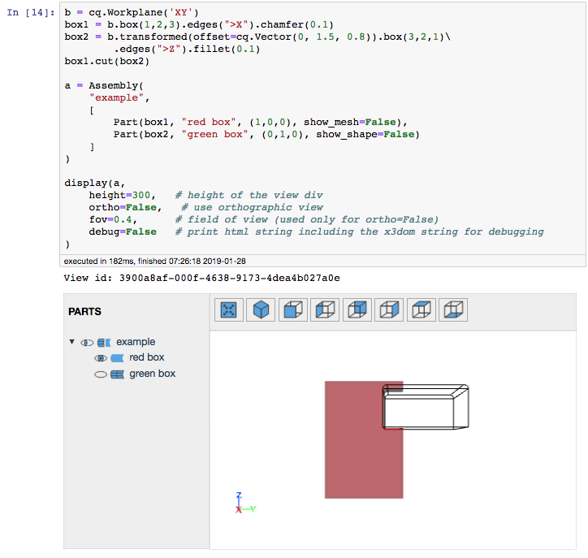
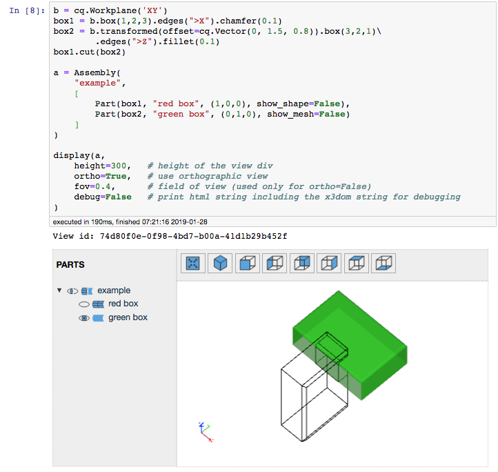
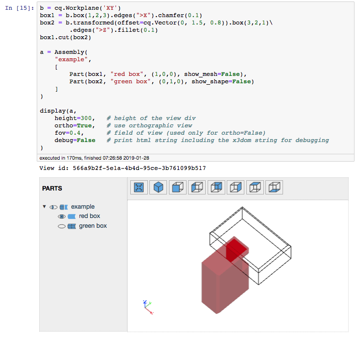

# CadQuery extension for Jupyter

*C U R R E N T L Y   N O T    U P   T O   D A T E*

## Overview

An extension to view X3DOM content created by CadQuery 2 ([https://github.com/CadQuery/cadquery](https://github.com/CadQuery/cadquery)). 

**Note:** The extension relies on *PythonOCC* and will not run with the *FreeCAD* version of *CadQuery 1* or *CadQuery 2*.

If CQParts ([https://github.com/cqparts/cqparts](https://github.com/cqparts/cqparts)) is not used, two simple alternative classes are available:

- `Part`: A CadQuery shape plus some attributes for it:

    - `shape`: the cadquery shape
    - `name`: Part name in the view
    - `color`: Part color in the view
    - `show_shape`: show the faces of this particulat part
    - `show_mesh`: show the edges of this particular part

- `Assembly`: Basically a list of parts and some attributes for the view:

    - `name`: Assembly  name in the view
    - `objects`: all parts and assemblies included in the assembly as a list

## Integration into CadQuery and CQParts

### Display a CAD object

The extension is self contained, and comes with `display` function.

`display(cadObj, ortho=True, debug=False, default_color=None)` with:

- `cadObj` can be an instance of:

    - `cadquery.Shape`
    - `cadquery.Workplane`
    - `cq_jupyter.Assembly`
    - `cq_jupyter.Part`
    - `cqparts.Assembly`
    - `cqparts.Part`

- `height`: height of the view div (default: 400)
- `ortho = True` means orthographic view else normal x3dom view
- `fov`: field of view (used only for ortho=False) (default: 0.1)
- `debug = True` allows to print out the HTML string of the view
- `default_color` allows to set a default color if not set via `cq_jupyter.Assembly` or  `cq_jupyter.Part`

### Export a CAD object to STL

Simple helper to export an CAD object to STL

`exportSTL(cadObj, filename="/tmp/test.stl")` with:

- `cadObj` can again be an instance of:

    - `cadquery.Shape`
    - `cadquery.Workplane`
    - `cq_jupyter.Assembly`
    - `cq_jupyter.Part`
    - `cqparts.Assembly`
    - `cqparts.Part`

- `filename`: Path to STL write to write to.

## Installation

- Clone the repository and execute from within and execute:

    ```bash
    git clone https://github.com/bernhard-42/cadquery-jupyter-extension.git
    cd cadquery-jupyter-extension
    pip install .
    ```

- Enabling the extension

    ```bash
    jupyter nbextension install cq_jupyter --user
    jupyter nbextension enable cq_jupyter/js/main --user
    ```

## CadQuery Example 

see [examples/CadQuery-Example.ipynb](./examples/CadQuery-Example.ipynb)

```python
b = cq.Workplane('XY')
box1 = b.box(1,2,3).edges(">X").chamfer(0.1)
box2 = b.transformed(offset=cq.Vector(0, 1.5, 0.8)).box(3,2,1).edges(">Z").fillet(0.1)
box1.cut(box2)

a = Assembly(
    "example",
    [
        Part(box1, "red box", (1,0,0)),
        Part(box2, "green box", (0,1,0))
    ]
)
display(a,
    height=400,   # height of the view div
    ortho=True,   # use orthographic view
    fov=0.4,      # field of view (used only for ortho=False)
    debug=False   # print html string including the x3dom string for debugging
)
```

- **Normal view**:

  - **Isometric**:

      

  - **Side**:

      

- **Orthographic View**:

  - **Isometric**:

      

  - **Side**:

      


## CQParts Example

see [examples/CQParts-Example.ipynb](./examples/CQParts-Example.ipynb)

Source: [https://cqparts.github.io/cqparts/doc/tutorials/assembly.html]( https://cqparts.github.io/cqparts/doc/tutorials/assembly.html)

- **Complete Toy car**

    

- **Chassis only**

    

- **Partly edges only**

    


## Known issues

- **Too many WebGL contexts**: Browsers only support a fixed number of WebGL contexts. When this number is exceeded by rendereing multiple CadQuery objects or repeatedly rendering one object, a warning appears in the Javascript console "*WARNING: Too many active WebGL contexts. Oldest context will be lost.*" and older renderings in the notebook get lost.


## Credits

- **The viewer**

    The idea is based on the original implementation in cadquery 2, however leverages a proper Jupyter notebook extension and a Jinja2 template

- **x3dom**

    The x3dom framework ([https://www.x3dom.org](https://www.x3dom.org)) is available under the MIT license ([https://github.com/x3dom/component-editor/blob/master/LICENSE](https://github.com/x3dom/component-editor/blob/master/LICENSE)) and the files `css/x3dom.css` and `js/x3dom.js` are downloaded from [https://www.x3dom.org/download/1.7.2](https://www.x3dom.org/download/1.7.2) and used unchanged.

- **Component Editor for x3dom**

    The Component Editor for x3dom ([https://github.com/x3dom/component-editor](https://github.com/x3dom/component-editor)) is available under the MIT license ([https://github.com/x3dom/component-editor/blob/master/LICENSE](https://github.com/x3dom/component-editor/blob/master/LICENSE)):

    - the file `js/jquery.viewConnector.js` is downloaded from [https://github.com/x3dom/component-editor/blob/master/static/js/jquery.viewConnector.js](https://github.com/x3dom/component-editor/blob/master/static/js/jquery.viewConnector.js) and has been changed to support orthographic view.

    - the axis part in the file `x3d_template.j2` is based on [https://github.com/x3dom/component-editor/blob/master/static/x3d/axesSmall.x3d](https://github.com/x3dom/component-editor/blob/master/static/x3d/axesSmall.x3d)

## License

This software is licensed under the MIT license, see [LICENSE](./LICENSE)
